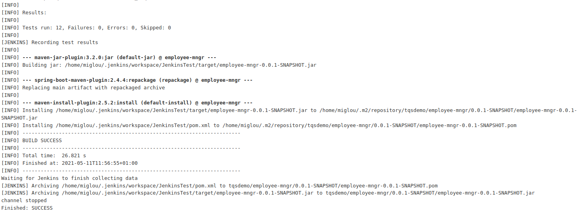
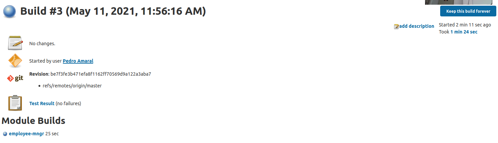
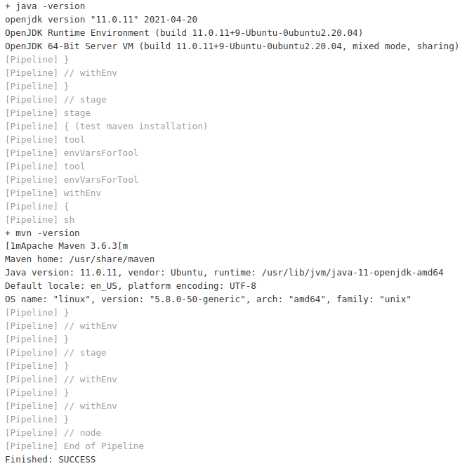
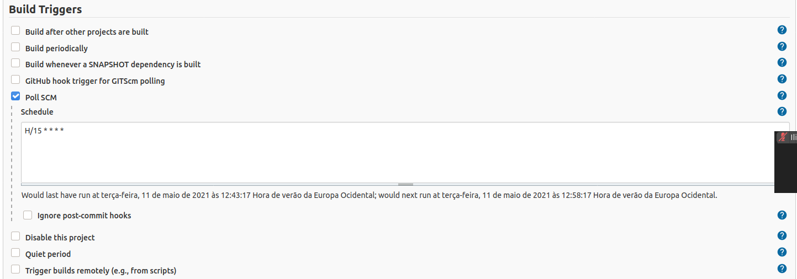
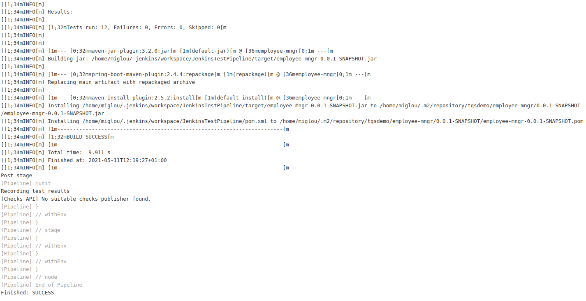
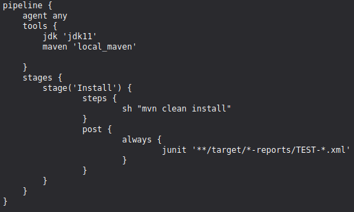
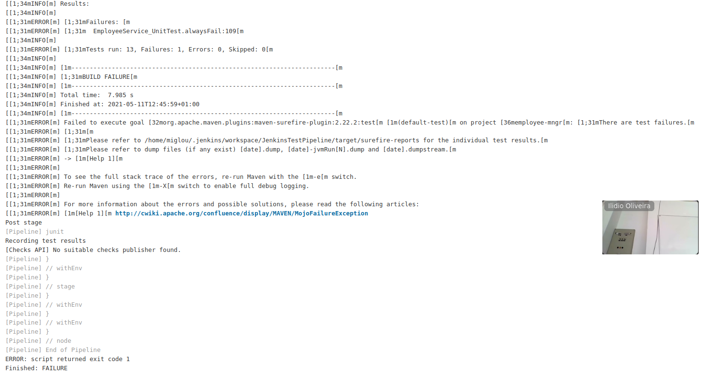
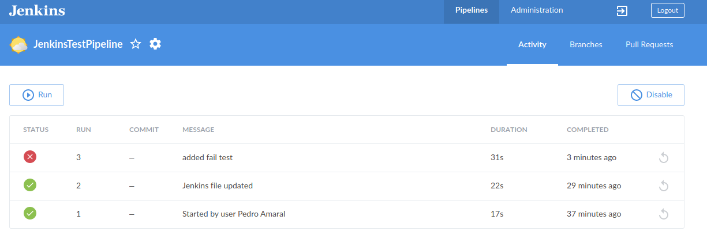

# Task1 - After running a build

# Task2 - Check java and maven version

# Task2 - Configure automated Polling Strategy

# Task2 - Sucessful Job

# Task2 - Jenkins Configuration File

# Task2 - Unsucessful Job after adding a failing test

# Task3 - Blue Ocean Interface
